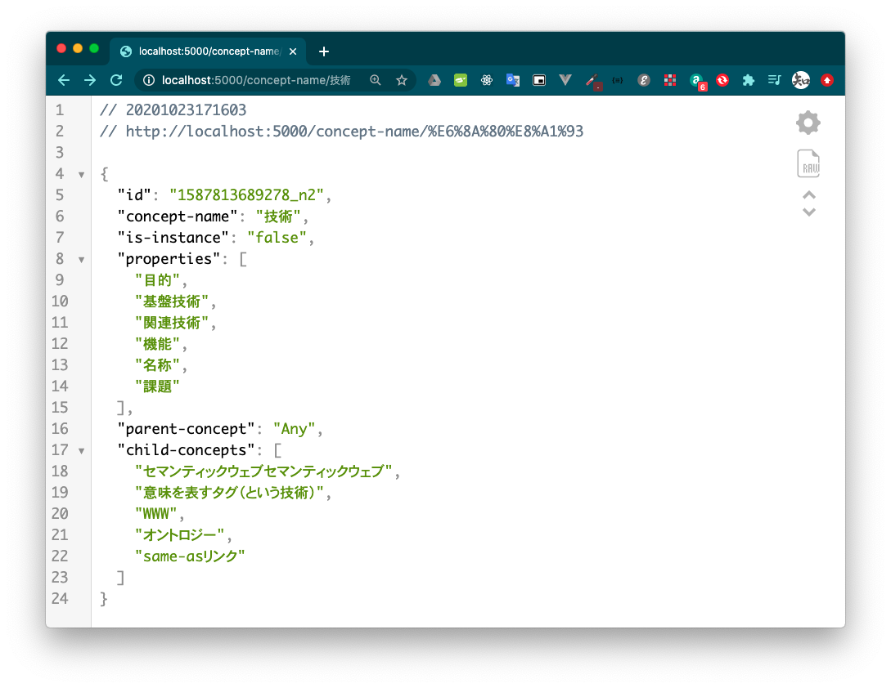

# 技術オントロジーマネージャー(Tech-Ontology-Manager)

Photonを利用した簡易版の技術オントロジーの管理コマンド


## インストール方法

```
以下，macOS用の手順なので，その他Linuxでは各自調査
Windowsでは多分動かないので注意

各項目でコマンドを実行のこと
```

- Homebrew（macOS用のパッケージマネージャー）のインストール

```
$ /bin/bash -c "$(curl -fsSL https://raw.githubusercontent.com/Homebrew/install/master/install.sh)"
```


- roswell（CommonLispの処理系マネージャー）のインストール

```
$ brew install roswell
```

- roswellによるCommon Lisp処理系の初期化

```
$ ros init
```

- roswellでインストールしたコマンドへのパスを通す

```
$ echo "export PATH=$PATH:~/.roswell/bin"
```

- 依存するパッケージのインストール

```
$ ros install dbym4820/photon
```

```
$ ros install dbym4820/tech-ontology-manager
```

- 技術オントロジーマネージャーの初期化

```
$ tom init
```

以下のような表示がでればOK
```
Initialize photon home directory: /Users/username/.photon/ ...
Ontology sample-ontology.xml has registered successfully!
Following ontology has registered as default... 
   * (sample-ontology /Users/username/.photon/ontology/sample-ontology.xml)

Ontology is Downloaded in /Users/username/.photon/ontology/dbym4820/ontologies/technology-ontology/v20200614.xml

Convert as Hozo formed ontology
Converting Basic concepts...
Converting IS-A relations...
Converting Part/Attribute concepts...
Converting Instance concepts...
Converting Sub-Part/Attribute-tree concepts...
Finalize...
   Converted Concepts
    * whole-root Any 技術 機能 課題 状態 問題解決状態 解決状態 未解決状態 行為概念 課題を解決する 自然言語の曖昧性を軽減するという課題 計算機が自然言語を理解できる 意味を表すタグ（という技術） セマンティックウェブセマンティックウェブ メタデータ同士の同一性を判定するという課題 セマンティックウェブの実現に関する課題 計算機が異なる呼び方が同じものを指すことを同定するという課題 人が他人の記述を意識せずに発信するという課題 計算機が自然言語文字列を意味を表すタグに基づいて概念タイプと対応付けるという課題 自然言語の曖昧性を軽減するという課題を解決する WWW ドキュメントの意味を計算機が理解するという課題 マルチエージェントの協調の仕組みを実現する課題 計算機解釈可能なメタデータを規定する課題 エージェントシステム間で意思疎通するための共通言語を用意する課題 問題解決のための手続きをメタデータ化する課題 適度に合意のとれたメタデータを開発・運用する課題 インターネット上に散在する文書同士を相互に参照する課題 概念の定義を計算機可読にする課題 オントロジー same-asリンク ドキュメントの意味を人間が理解するという課題を解決する インターネット上に散在する文書同士を相互に参照する課題を解決する 概念の定義を計算機可読にする課題を解決する メタデータ同士の同一性を判定するという課題を解決する ドキュメントのレイアウトを記述する ドキュメント同士のリンクを記述する 著者やページごとに異なる表現で同じものを指し示すことがある 著者は別の文章を意識せずに自由に書くことができる タグ付けされたメタデータに紐づいたオントロジーに基づいて情報が処理される ドキュメントの意味を計算機が理解できる 自然言語に計算機可読な意味を紐づける 自然言語文字列を計算機がタグに基づいて理解できる ある概念を人がモデル化する メタデータを定める 意味処理を伴う高度な計算機処理を実現できる 異なるサイトの同じ概念同士をつなぐことができる 異なる呼び方をされているものでも同じものだとみなすことができる 概念定義を一意に定めることができる ドキュメントの意味を計算機が理解するという課題を解決する ドキュメントの意味を人間が理解するという課題

Writing ontology details is finished!
Initialize completed!
```

## コマンドの使い方

- tom concept-name：概念名から該当概念の諸定義をJSON形式で呼び出すオプション

```
$ tom concept-name "技術"

{"id":"1587813689278_n2","concept-name":"技術","is-instance":"false","properties":["目的","基盤技術","関連技術","機能","名称","課題"],"parent-concept":"Any","child-concepts":["セマンティックウェブセマンティックウェブ","意味を表すタグ（という技術）","WWW","オントロジー","same-asリンク"]}
```


- tom concept-id：概念のIDから該当概念の諸定義をJSON形式で呼び出すオプション

```
$ tom concept-id "1589622207000_n81"

{"id":"1589622207000_n81","concept-name":"same-asリンク","is-instance":"true","properties":["目的","関連技術","機能"],"parent-concept":"技術","child-concepts":[]}
```

- tom start-server：上記同様の結果を得るためのWebサーバーを5000番ポートで立ち上げるオプション

```
$ tom start-server
Hunchentoot server is started.
Listening on localhost:5000.
```

```
# 上記Webサーバーへのリクエストとレスポンス
# ページ名として，concept-nameとconcept-idを取る
# クエリパラメータとしてconceptというパラメータ名で文字列を取る
# もちろんブラウザからアクセス可能
# (http://localhost:5000/concept-name?concept="技術"')

$ curl -G 'http://localhost:5000/concept-name' --data-urlencode 'concept="技術"'

{"id":"1587813689278_n2","concept-name":"技術","is-instance":"false","properties":["目的","基盤技術","関連技術","機能","名称","課題"],"parent-concept":"Any","child-concepts":["セマンティックウェブセマンティックウェブ","意味を表すタグ（という技術）","WWW","オントロジー","same-asリンク"]}
```


## ブラウザで実行したときのイメージ（GoogleChromeの場合）


